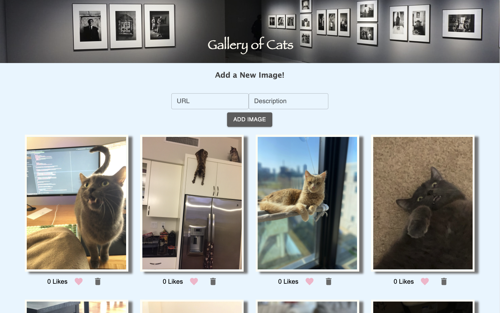
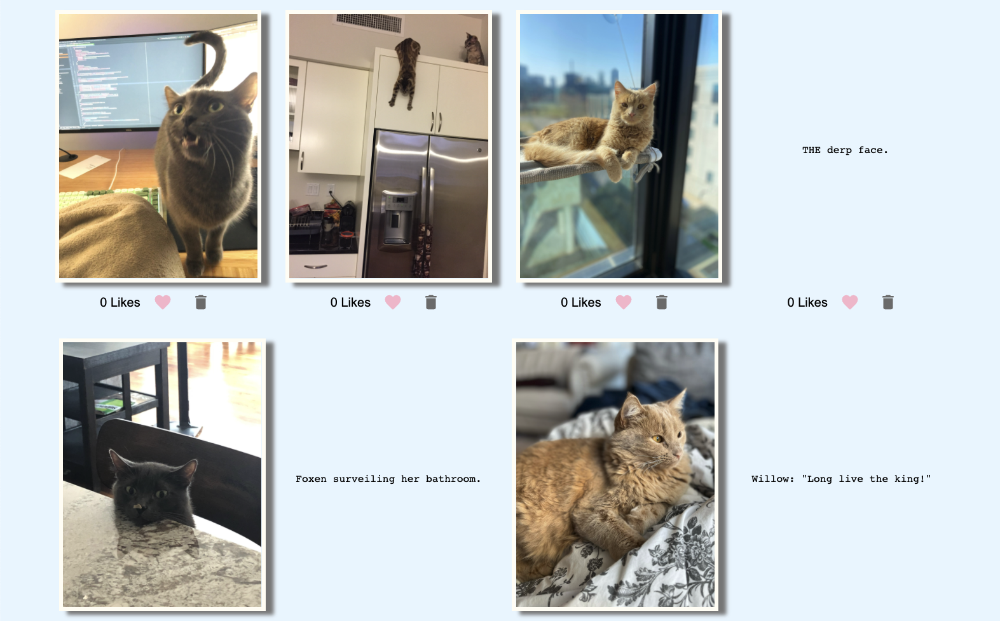

# React Gallery

## Description

*Duration: Weekend Project (3-4 days)*

This React Gallery is a fullstack full CRUD app. I've chosen not to use a database with this project and focus on learning Material UI styling. So all of the photos are stored in the project and a database does not need to be set up. Users can see all of my favorite photos of my cats and also input their own! Then hit that heart to like the photo or choose to delete it.

## Screen Shots
___


Clicking on a photo brings up the description.



### Prerequisites

- Node.js
- Axios
- Sweetalert
- MaterialUI

## Installation
___

1. Fork and clone.
2. Run the commands ```npm init --yes``` and ```npm install``` in your IDE terminal.
3. Start your server with ```npm run server``` and start your client with ```npm run client```.
4. If you want to add your own photos or remove mine, make sure you add/remove mine from the ```public/images``` file and update the ```server/modules/gallery.data.js``` file with the new paths.
5. Everything is good to go now! Don't forget to shut down your server and client when you're done!

## Usage
___

1. There are so many ways you can start, if you want to like every photo 10 times first. Please do!
2. Or you can delete all of my cats by clicking the trash can and add your own photos with the URL and description inputs at the top of the page.
3. If you click anywhere on an image you can see the description of it, likewise if you click anywhere near the description the image will be toggled back on.

## Built With
___

- JavaScript
- React
- Node.js
- Axios
- Sweetalert
- MaterialUI
- HTML/CSS

## Acknowledgement
___

Thanks to Prime Digital Academy who equipped and helped me to make this application a reality. Special thanks to my instructor [Matthew Black](https://github.com/matthew-black)!

## Support
___

If you have suggestions or issues, please email me at [kayla.mir32@gmail.com](mailto:kayla.mir32@gmail.com).  
